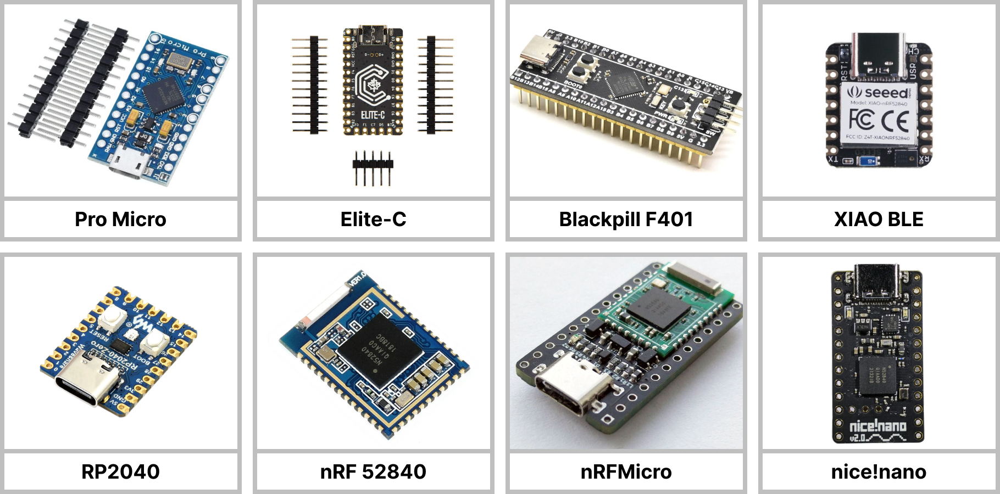

# ergosplits

Если вы купили раздельную клавиатуру, может показаться, что начать работу с ней довольно сложно. Но это только кажется.

Ваша клавиатура работает на двух микроконтроллерах, если она раздельная. И на одном если это моносплит.

Контроллеры могут быть разными - Pro Micro, Elite-C, Blackpill, RP2040, nRF22480, nRF52840, nRF52833 и так далее.



Для того чтобы ваша клавиатура работала вам нужно прошить этот контроллер. Для этого нужно сначала скомпилировать прошивку, а потом загрузить ее на контроллер.

Звучит страшно, но на самом деле это довольно простой процесс. Особенно если для контроллера есть поддержка [VIA](https://www.caniusevia.com/) или [Vial](https://get.vial.today/).

## Прошивка клавиауры на QMK

Для того чтобы прошить клавиатуру с помощью QMK, нам надо для начала установить непосредственно сам QMK.

- Для Windows можно использовать [QMK MSYS](https://github.com/qmk/qmk_distro_msys/releases/latest)
- Для [Linux](https://github.com/qmk/qmk_cli) и [macOS](https://github.com/qmk/homebrew-qmk) можно скачать их из пакетных менеджеров или [использовать Docker](https://docs.qmk.fm/#/getting_started_docker).

Open the `QMK MSYS` shortcut

Run [`qmk setup`](https://docs.qmk.fm/#/newbs_getting_started?id=set-up-qmk)[](https://docs.qmk.fm/#/newbs_getting_started?id=set-up-qmk)[](https://docs.qmk.fm/#/newbs_getting_started?id=set-up-qmk)

## Изменяем раскладку в QMK

Для того чтобы изменить раскладку вам нужно отредактировать файл кеймапа своей клавиатуры

Например, у вас клавиатура 3x6 с трекболом

Для этого нужно редактировать файл `bastardkb/charybdis/3x6/keymaps/default/keymap.c`

Если у вас 4x6, то соответственно редактируем `charybdis/4x6/keymaps/default/keymap.c`

По своему желанию можете собрать и кеймап с поддержкой VIA или Vial

## Компилируем прошивку

Первым делом нужно установить QMK и в разорхивировать в него [этот архив](https://github.com/devpew/ergosplits/blob/main/files/bastardkb.zip)

Для того чтобы скомпилировать прошивку для своей клавиатуры нужно знать пару вещей. Первое это собственно какая у вас клавиатура.

Если у вас Scylla с трекболом указываем `charybdis/3x6`
Если у вас TBK Mini с трекболом указываем `charybdis/4x6`
Если у вас Charybdis Mini с трекболом указываем `charybdis/3x5`

Кроме того нужно знать какой у вас контроллер. Чаще всего это promicro.

В итоге, сама команда для компиляции прошивки будет выглядеть как-то так

```
qmk compile -kb bastardkb/charybdis/3x6/v2/promicro -km default
```

## Хочу изменить чувствительность трекбола, чувствительность прокрутки или чувствительность прокрутки каретки

Все это делается в файле `charybdis/charybdis.c`

## Раскладка

Для этой клавиатуры (да и для всех раздельных клавиатур) нет какой-то универсальной раскладки — то есть каждый составляет раскладку которая будет удобна лично ему.

Поэтому, пожалуйста, не нужно задавать вопросы вроде "А где у этой клавиатуры слой с цифрами?". Слой с цифрами будет там где вы этого захотите.
